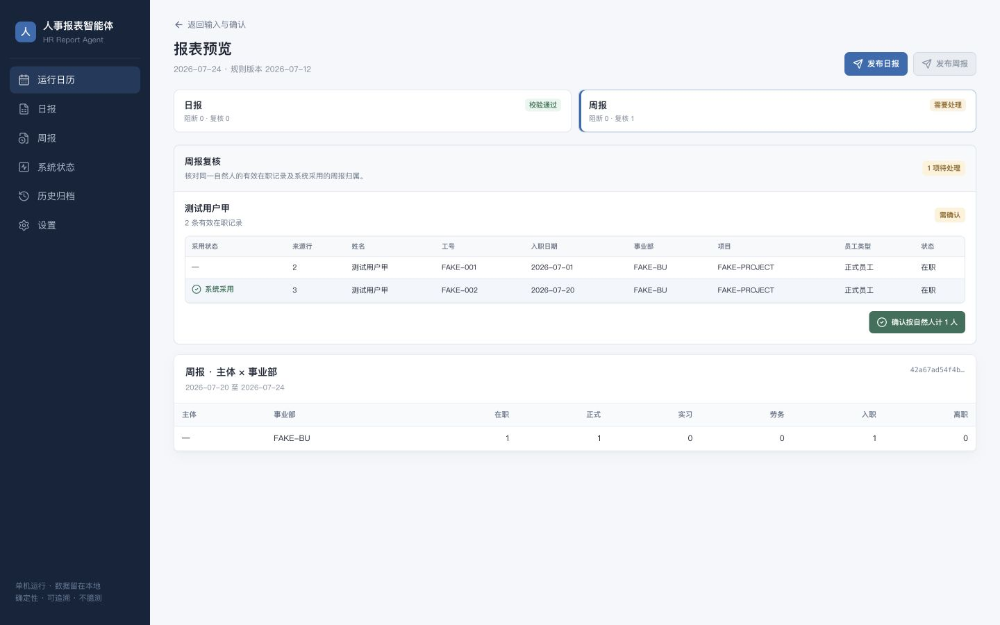
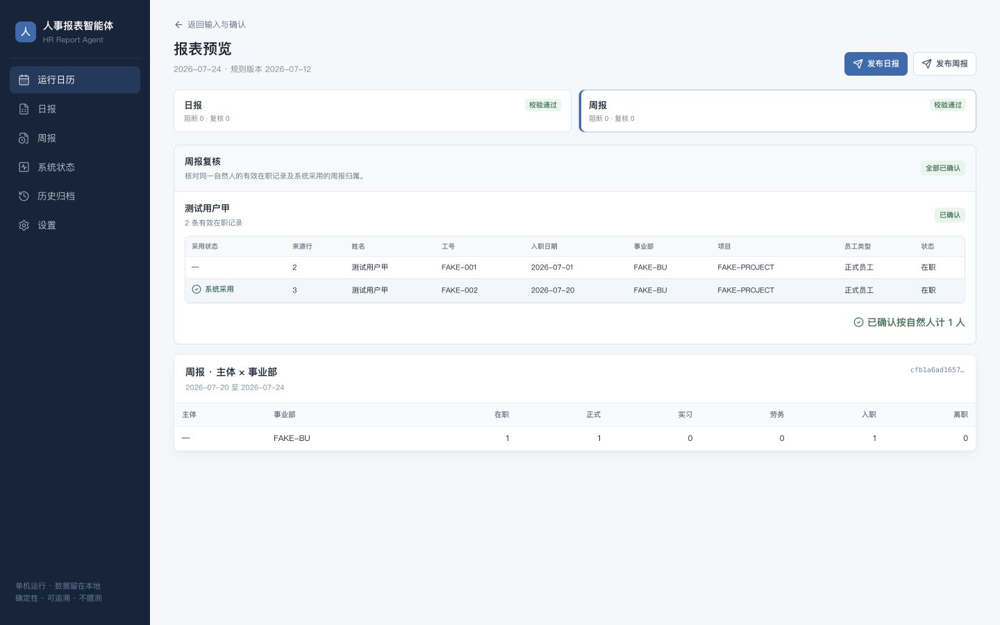
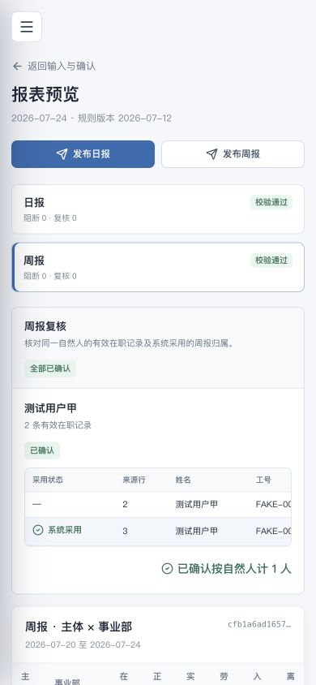
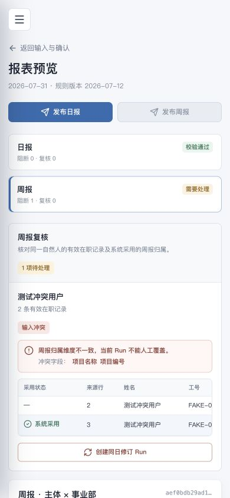

# OCR 与周报复核界面验收记录

日期：2026-07-17

## 验收范围

- OA/Release 与招聘 OCR 的结构化识别结果可在确认前查看。
- 周报重复有效在职记录有独立复核窗口。
- 归属维度一致时，只允许精确确认“按自然人计 1 人”。
- 归属维度冲突时，只允许创建同日修订 Run，不能人工覆盖。
- 日报、周报分别发布；周报复核完成后重新计算发布状态。
- 桌面端与移动端均可完成复核，宽表只在表格容器内横向滚动。

## 数据隔离

浏览器交互验收使用两条纯假数据 Run：

- 可确认场景：`0e852480-f6d0-4985-a1fe-afeb7f442328`
- 冲突场景：`79cb7c9b-96fc-4d3b-9307-980c864ae268`

姓名、工号、事业部和项目均为测试值。既有 2026-07-17 Run 只做只读界面检查，没有执行确认、修订或发布。

## 验收结果

| 场景 | 结果 |
| --- | --- |
| 待确认重复记录 | 显示两条来源记录、来源行、系统采用记录和精确确认按钮 |
| 确认交互 | 提交成功后确认按钮消失，复核数归零，周报发布按钮解锁 |
| 已确认状态 | 面板显示“全部已确认”和“已确认”，不再误报“1 项待处理” |
| 冲突记录 | 显示本地化冲突字段；无确认按钮；仅显示“创建同日修订 Run” |
| 冲突发布 | 周报发布按钮保持禁用 |
| 移动端 | 页面无整页横向溢出；复核宽表在容器内滚动；操作按钮可见 |
| 数据安全 | 页面与接口未暴露 `person_key`、数据库主键、原始 OCR 图片或证件字段 |

## 验收中发现并修复的问题

1. 确认后标题仍按复核项总数显示“1 项待处理”。现按未处理项计数，全部完成时显示“全部已确认”。
2. 前端并发请求日报和周报预览，两个端点会同时写入同一 Run 的校验记录，MySQL 可产生死锁并令周报返回 500。现将两个有状态预览请求串行执行，基线报告继续作为只读请求并行加载。

## 自动化回归

- 后端：`242 passed, 9 skipped`
- 前端：`10` 个测试文件、`37 passed`
- 前端 `npm run lint`：通过
- 前端 `npm run build`：通过

## 视觉证据

待确认桌面端：

确认完成桌面端：

确认完成移动端：

冲突处理移动端：

