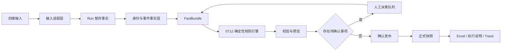
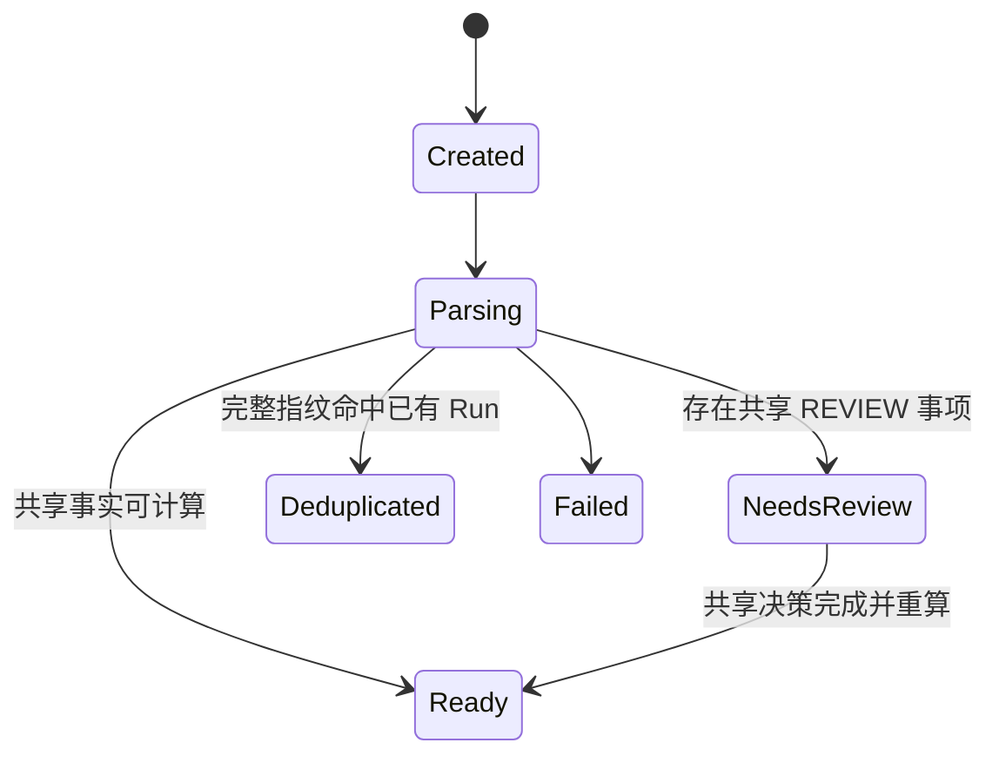
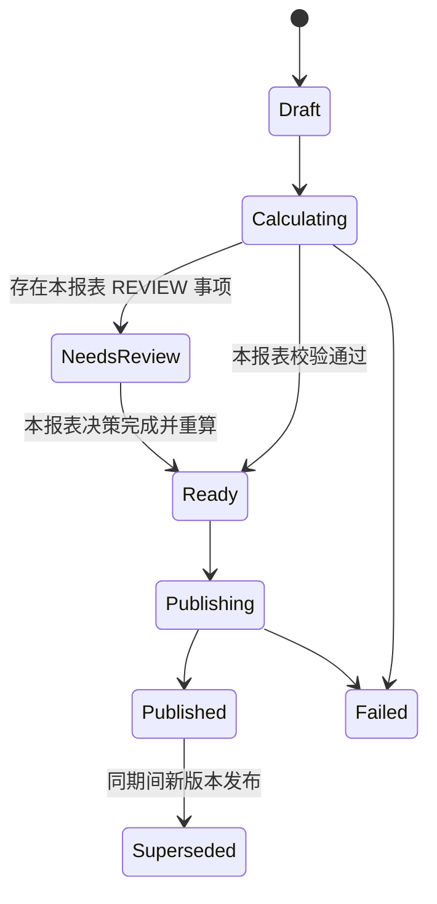

# 人事日报/周报智能体单用户正式版设计规格

日期：2026-07-15  
状态：已完成对话评审，待规格文件复核  
实施分支：`feature/single-user-production-v1`

## 1. 背景

本项目需要把 A 组现有的人事报表 WebApp 改造成可以交给 HR 同事本地或内网部署的单用户正式版。正式版接收四类输入，按照当前有效 SOP 生成固定格式日报和周报，并保留可解释的运行记录、事件台账、校验结果和发布版本。

现有 A 组 2026-07-12 后端已经通过真实日报链路和周报回归，计算规则与 Excel 导出具有较高复用价值。但当前系统仍以可变业务主表直接计算并生成报表，缺少 Run 隔离、预览发布、稳定自然人身份、输入包哈希和完整发布证据。当前前端还存在文件误分类、错误状态退化、日期切换后下载旧报表等风险。

正式版采用渐进式改造：保留已验证的确定性规则与导出器，在其外建立 Run、规范事实、人工决策、校验、预览和发布边界。

## 2. 目标

1. 支持单用户完成“日期选择、四类输入、解析确认、预览、发布、下载”的完整流程。
2. 数值由确定性 Python 规则计算，LLM 只用于 OCR、解释和辅助校对。
3. 未发布或失败的运行不得修改正式日报、周报或已发布事实。
4. 支持同一自然人多个员工编号，避免人员、事件和周报在岗人数重复计数。
5. 保留现有 Excel 模板、累计列、样式和在岗时长 Sheet。
6. 每个关键结果都能追溯到输入来源、事件、规则版本、人工决策和校验结果。
7. 提供 Docker Compose 推荐部署方式，同时保留 Windows/macOS 手工启动文档。
8. 使用 `project/日报` 中 2026-07-08 起的已验收材料做导师本地真实回归，不将真实输入或答案提交到代码仓库。

## 3. 非目标

1. 首版不实现多用户、角色、租户和组织权限。
2. 首版不实现月报；月报等待 HR 口径会议后单独设计。
3. 首版不提供自然语言转 SQL 或任意人员明细查询。
4. “离职明细”不是正式输入，不增加独立入口、模型或页面。
5. 不允许 LLM 直接计算或覆盖日报、周报数值。
6. 不对无法确定的自然人、流程重叠或 OCR 结果进行静默猜测。
7. 不整体合并 Mike 分支或 B 组仓库。

## 4. 代码与版本基线

### 4.1 后端

- 仓库：A 组 backend。
- 基线：`feature/hr-report-staging-readiness-20260712`。
- 基线提交：`dd7357d`。
- 正式改造分支：`feature/single-user-production-v1`。

### 4.2 前端

- 仓库：A 组 frontend。
- 基线：`origin/merge_branch`，评审时提交 `9551338`。
- 实施时创建同名分支 `feature/single-user-production-v1`。

### 4.3 数据库

- 仓库：A 组 database。
- 基线：2026-07-12 验证分支，评审时提交 `01eaf08`。
- 实施时创建同名分支 `feature/single-user-production-v1`。

### 4.4 参考代码

- B 组 `hr_platform` 只参考日历入口、日期状态和问题确认交互。
- Mike 分支只参考纠错队列、设置导航和部分测试组织方式。
- 所有参考代码必须按 A 组 API 契约和本规格重写或选择性移植，不做无共同历史的 Git 合并。

## 5. 业务事实权威顺序

规则冲突按以下顺序处理：

1. 已验收的日期目录 Excel 与对应执行说明。
2. 最新日期执行说明形成的业务先例。
3. 当前有效 Harness 处理规范。
4. 当前日报、周报执行手册和历史处理报告。
5. 学生资料包和代码内说明。

导师本地真实回归以 2026-07-08 起、目前确认无误的日报与周报材料为准。仓库内测试只使用假数据。

## 6. 选定方案

采用“验证核心外增加正式运行层”的方案：



解析、计算和预览可以重复执行。只有确认发布可以写入正式快照和正式产物。

## 7. 模块边界

### 7.1 `ingestion`

负责文件接收、类型确认、schema 校验、哈希、临时文件生命周期和解析任务。不得写入正式报表表。

### 7.2 `identity`

负责证件类型与证件号码规范化、HMAC 身份键、员工编号回退键、置信度和人工合并判定。不得保存证件号码明文。

### 7.3 `facts`

负责把四类输入转换为 Run 范围内的规范事实和事件台账。所有事实都带 `run_id`、来源类型、来源行号和首次可见日期。

### 7.4 `rules`

负责从 `FactBundle` 生成日报、周报和在岗时长计算结果。该层不直接查询上传文件或可变业务主表。

### 7.5 `validation`

负责输入、事件、公式、快照、日报周报闭环、Excel 结构和发布一致性校验。

### 7.6 `decisions`

负责人工确认事项。人工只能修改事实分类或决策，不能直接填写最终报表数值。

### 7.7 `publication`

负责预览版本、原子发布、正式版本替代、产物哈希和下载授权。

### 7.8 `ui`

负责日历、当日 Run、待确认、预览、发布、日报、周报、运行记录、设置和系统状态。

## 8. 数据模型

### 8.1 `report_runs`

记录一次运行：

- `id`
- `report_date`
- `status`
- `rule_version`
- `source_bundle_hash`
- `baseline_report_id`
- `canonical_run_id`
- `attempt_no`
- `error_code`
- `error_message_redacted`
- `created_at`
- `updated_at`

Run 刚创建时 `source_bundle_hash` 为空。四类来源均解析成功且基线固定后，由四类来源哈希、基线报告 ID 和基线产物哈希按固定顺序计算完整指纹。`report_date + rule_version + source_bundle_hash` 建立唯一约束，用于幂等复用；相同四表但不同基线必须创建不同 Run。

若完整指纹命中已有 Run，服务返回已有 Run，并把本次临时 Run 标记为 `Deduplicated`、记录 `canonical_run_id`，然后删除临时 Run 的重复规范事实。MySQL 唯一约束负责处理并发上传第四类来源时的竞争条件。

### 8.2 `run_sources`

每个 Run 的四类输入各一行：

- `run_id`
- `source_type`
- `sha256`
- `schema_version`
- `parser_version`
- `media_type`
- `row_count`
- `parse_status`
- `original_extension`

不保存文件字节、原始路径和可能含人员信息的原始文件名。

### 8.3 `person_identities`

- `id`
- `person_key`
- `key_version`
- `match_confidence`
- `identity_namespace`

`person_key` 唯一。表中不得出现证件类型或证件号码明文。

### 8.4 `employment_facts`

每个员工编号对应一段任职记录：

- `run_id`
- `source_row_no`
- `person_id`
- `employee_no`
- `display_name`
- `employee_type`
- `status`
- `entry_date`
- `resign_date`
- `business_unit`
- `business_unit_no`
- `project_code`
- `project_name`
- `contract_dates`
- `first_visible_dates`

`employee_no` 和 `display_name` 是 HR 确认所需的受保护字段，只存在于受控数据库和确认界面，不进入普通日志、公开 Trace 或 Git。

### 8.5 `resignation_facts`

- `run_id`
- `source_row_no`
- `process_no`
- `person_id`
- `employee_no`
- `process_status`
- `application_date`
- `last_working_day`
- `resignation_type`
- `first_visible_date`

### 8.6 `release_facts`

- `run_id`
- `source_row_no`
- `order_no`
- `person_id`
- `employee_no`
- `application_date`
- `last_working_day`
- `process_status`
- `first_visible_date`
- `row5_classification`
- `row30_classification`
- `ocr_confidence`

### 8.7 `recruitment_snapshots`

- `run_id`
- `source_row_no`
- `report_date`
- `is_total_row`
- `previous_month_offer_current_month_onboard`
- `current_month_offer_current_month_onboard`
- `recognized_labels`
- `ocr_confidence`

`is_total_row` 必须保留，用于复现 0712 规则中的逐行求和与合计行交叉校验；不得只保存合计数而丢失该语义。

### 8.8 `fact_events`

- `run_id`
- `event_key`
- `event_type`
- `person_id`
- `employment_ref`
- `source_type`
- `source_event_ref`
- `effective_date`
- `first_visible_date`
- `classification`
- `minimal_payload`

`event_key` 是稳定事件标识。源内首先按流程号或单号去重，跨源再按自然人、事件类型和日期判断重叠候选。

### 8.9 `run_decisions`

- `run_id`
- `report_kind`
- `decision_code`
- `fact_ref`
- `question`
- `options`
- `answer`
- `status`
- `decided_at`
- `operator_ref`

`report_kind` 可为 `daily`、`weekly` 或空；空表示影响共享事实。单用户版本的 `operator_ref` 来自部署配置中的本地操作员标识，不建立用户和权限表。

### 8.10 `run_validations`

- `run_id`
- `report_kind`
- `validation_code`
- `severity`
- `outcome`
- `message`
- `evidence_refs`

`report_kind` 可为 `daily`、`weekly` 或 `shared`。严重度为 `BLOCK`、`REVIEW`、`INFO`；结果为 `PASS` 或 `FAIL`。证据只保存计数、规则引用和脱敏事实引用。

### 8.11 `run_report_targets`

同一输入 Run 可以分别生成日报和周报目标：

- `run_id`
- `report_kind`
- `status`
- `preview_hash`
- `validation_summary`
- `published_report_id`
- `error_code`
- `updated_at`

`run_id + report_kind` 唯一。日报和周报分别进入 `Draft`、`Calculating`、`NeedsReview`、`Ready`、`Publishing`、`Published` 或 `Failed`，因此周报失败不会改变已发布日报的状态。

### 8.12 `published_reports`

- `id`
- `run_id`
- `report_kind`
- `period_start`
- `period_end`
- `version`
- `is_current`
- `snapshot_json`
- `baseline_report_id`
- `published_at`
- `superseded_at`

同一日报日期或周报期间只能有一个 `is_current = true` 的版本。

### 8.13 `report_artifacts`

- `report_id`
- `artifact_kind`
- `protected_path`
- `sha256`
- `size_bytes`
- `created_at`

正式产物包括 Excel、执行说明、事件台账和验证报告。

### 8.14 兼容投影

迁移期间保留现有 `daily_reports`、`weekly_reports`、`employee_snapshots` 和月初基线表作为已发布投影。预览不写这些表；发布事务才更新兼容投影。后续读取逐步切换到 `published_reports`。

## 9. 稳定自然人身份

### 9.1 生成方式

```text
person_key = HMAC-SHA256(
  PERSON_KEY_SECRET,
  normalize(certificate_type) + ":" + normalize(certificate_number)
)
```

- `PERSON_KEY_SECRET` 只从环境变量读取。
- 生产和恢复环境必须使用同一个密钥。
- 密钥轮换通过 `key_version` 管理，不允许无迁移地直接替换。
- 证件号码只在解析内存中短暂存在，生成身份键后立即从 DataFrame 删除。

### 9.2 回退

缺少证件号码时生成带命名空间的员工编号 HMAC，置信度标记为 `employee_no_fallback`。该键只能在同一员工编号内匹配，不能跨员工编号自动合并。

### 9.3 禁止行为

- 不按姓名自动合并。
- 不把多个员工编号直接覆盖成一条任职记录。
- 不在日志或 Trace 中输出完整身份键、证件号码或姓名。

### 9.4 计数语义

- 周末在岗人数按 `person_key` 去重。
- 入职和离职按任职事件判断，允许重新入职形成新的合法事件。
- 同一自然人在同一期间出现多条冲突的有效任职事件时进入 `REVIEW`，不静默选择。
- 多条同时有效任职记录若 BU 或项目冲突，阻止周报发布并要求确认当前归属。

## 10. 输入契约与数据最小化

正式每日输入固定为：

1. 人员表 Excel。
2. 离职人员报表 Excel。
3. OA/Release 截图或等价结构化 Excel。
4. 招聘截图或等价结构化 Excel。

月初基线 Excel 是独立控制输入，不属于四类日常输入。“离职明细”不是正式入口。

规则：

- 文件类型由用户在四个独立入口明确选择，系统只做 schema 二次确认。
- 不根据上传顺序把未知文件自动塞入空槽位。
- 每个 Run 必须明确提供或重新确认四类输入。
- 人员表和离职表按字段名识别，不依赖文件名、列字母或固定行号。
- 解析器只投影规则需要的字段。
- 银行卡、电话、地址、个人邮箱、生日等无关字段不得进入规范事实。
- 原始文件只存在于权限受限的临时目录，解析成功或失败后均在 `finally` 中删除。
- 系统保存输入 SHA-256、schema 版本、解析器版本和最小事实，不长期保存原始文件。
- HR 在现有日报目录中自行归档原始文件；需要重新 OCR 或重新解析时重新选择原文件。

## 11. Run 与报表目标状态机





规则：

- 相同报告日、规则版本、四类输入和基线哈希复用已有 Run。
- `Created` Run 允许四类来源逐项上传；完整指纹只在四类来源和基线全部就绪后生成。
- 并发完成相同输入时，只有一个 Run 成为规范 Run，其余进入 `Deduplicated` 并指向 `canonical_run_id`。
- 输入改变时创建新 Run，不覆盖旧 Run。
- 瞬时基础设施错误允许同一 Run 增加 `attempt_no` 后重试。
- 业务输入改变或人工决策改变后必须重新构建 FactBundle 和验证结果。
- Run 的共享 `NeedsReview` 或 `Failed` 会阻止日报和周报；报表目标自己的 `NeedsReview` 或 `Failed` 只阻止该报表。
- 日报和周报分别发布。一个目标发布后，其正式状态不受另一目标失败影响。
- 任一目标发布后，共享事实和共享决策冻结。只影响未发布周报的周报决策仍可继续；若需修改共享事实，必须创建新 Run。
- 已发布目标不可修改；更正通过新 Run 和新正式版本完成。

## 12. 计算边界

计算入口统一为：

```text
FactBundleBuilder
  -> FactBundle
  -> DailyRuleEngine / WeeklyRuleEngine / TenureRuleEngine
  -> CalculationResult
  -> Validators
  -> PreviewSnapshot
```

### 12.1 `FactBundle`

包含当前 Run 的人员任职事实、离职流程、OA/Release、招聘快照、事件台账、人工决策、规则版本和已发布基线。计算层不得自行读取上传文件。

### 12.2 0712 规则复用

0712 的日报、周报、在岗时长、月初基线、校验和 Excel 导出代码在行为测试保护下逐步提取为纯计算接口。先增加适配层，再拆分大文件，不做一次性重写。

### 12.3 确定性要求

- Row2 至 Row40 全部由确定性规则产生。
- LLM 结果必须先成为可查看、可修改的结构化事实。
- 人工决策只改变事实分类或事件关系，不允许直接写最终数值。
- 规则版本和配置哈希随 Run 固化。

## 13. 核心业务语义

### 13.1 日报

- Row2/Row3 使用事实日期与首次可见日期确定归属日。
- 迟到事实计入首次可见的当前报告日，不改写已发布历史列。
- 有离职流程时，实际离职必须综合同一员工/自然人的全部流程状态；任何有效生效状态优先于审批中或拒绝状态。
- Row5 与 Row30 分离；缺少 LWD 可以进入 Row5，但不能进入 Row30。
- Row31 与 Row32 按申请月份、LWD 月份和有效流程状态重建。
- Row37 必须等于 Row8；招聘截图“已入职”不得覆盖人员链。
- Row38/Row39 是当日招聘预测快照，不作为增量累加。
- 月初 MTD 重置，YTD 从已确认月初基线延续。

### 13.2 周报

- 使用窗口结束日人员快照计算在岗人数。
- 在岗人数按自然人去重，并按当前有效任职记录归属 BU 和项目。
- 周内入职、离职与日报 Row2/Row3 的归属日语义一致。
- Sheet2 每次从窗口结束日事实重算，不沿用上一周明细。
- 项目按配置的规范族归并，再取前三。
- 第三名并列时先按规范项目名稳定排序生成候选，同时创建 `REVIEW` 项；HR 确认前不得发布周报。
- 日报和周报独立校验、独立发布。周报失败不阻塞当日日报。

### 13.3 月初基线

- 非首月报告使用已发布前一工作日报表作为默认链式基线。
- 每月首个报告日必须选择已确认的月初基线。
- 基线导入记录模板哈希、来源、操作员标识和确认时间。
- 无法映射到人员级事件的已确认聚合修正，以 `baseline_aggregate_adjustment` 事实保存，不伪造人员明细。
- 基线更正只生成后续日期的差异预览，不自动重新发布。

## 14. 校验分级

### 14.1 `BLOCK`

- 缺少四类输入。
- schema 不匹配。
- 基线缺失或未确认。
- 日报关键公式不成立。
- 历史列被修改。
- Excel 结构、日期列或在岗时长控制数失败。
- 周报在岗拆分、项目总数或日报闭环失败。
- 发布产物不等于预览快照。

### 14.2 `REVIEW`

- OCR 低置信或关键字段缺失。
- 缺证件号码且需要跨员工编号关联。
- 多条有效任职记录的 BU 或项目冲突。
- OA 与离职流程疑似同人同事件。
- 协商/被动离职分类不明确。
- 周报第三名并列。
- 招聘标签变化但仍可解析出候选字段。

### 14.3 `INFO`

- 无变化来源重新上传。
- 使用结构化 Excel 替代截图。
- 报告与上一正式版本无数值差异。
- 规则版本、解析器版本和耗时统计。

## 15. 预览与发布

### 15.1 预览

预览展示：

- 本次日报或周报数值。
- 上一正式版本或基线。
- 变化行及增量。
- 对应事件、来源行号和规则说明。
- 全部校验和人工决策状态。
- Excel 预览及待生成产物清单。

### 15.2 发布事务

1. 锁定报告日期或周期间。
2. 重新检查 Run 状态、规则版本和校验结果。
3. 在临时目录生成 Excel、执行说明、事件台账和验证报告。
4. 重新解析生成的 Excel，验证其与预览快照一致。
5. 在一个数据库事务中写入正式快照、产物元数据和兼容投影。
6. 将临时产物原子移动到受保护正式目录。
7. 标记旧正式版本为 `Superseded`。

任何步骤失败都不得留下半发布版本。产物移动与数据库提交之间通过发布恢复记录处理极端中断；服务启动时自动检查并恢复或回滚未完成发布。

### 15.3 正式产物

- 日报 Excel。
- 周报 Excel。
- 日报或周报执行说明 Markdown。
- 事件台账 JSON/CSV。
- 验证报告 JSON/Markdown。
- 产物 manifest，包含 Run、规则版本、输入哈希和各产物哈希。

## 16. API 契约

### 16.1 日历与运行

- `GET /api/calendar?month=YYYY-MM`
- `POST /api/runs`
- `GET /api/runs/{run_id}`
- `POST /api/runs/{run_id}/retry`

创建 Run 请求包含报告日期和可选基线 ID。响应明确返回复用的现有 Run 或新 Run。

### 16.2 输入

- `PUT /api/runs/{run_id}/sources/{source_type}`
- `GET /api/runs/{run_id}/sources`
- `POST /api/runs/{run_id}/parse`

`source_type` 仅允许 `personnel`、`resignation`、`release`、`recruitment`。

### 16.3 决策

- `GET /api/runs/{run_id}/decisions`
- `POST /api/runs/{run_id}/decisions/{decision_id}`

提交决策后服务端重新构建事实、计算和校验，不接受客户端提交最终报表数值。

### 16.4 预览与发布

- `GET /api/runs/{run_id}/preview/daily`
- `GET /api/runs/{run_id}/preview/weekly`
- `POST /api/runs/{run_id}/publish`

发布请求显式列出 `daily`、`weekly` 或二者。两种报表分别校验和创建正式版本。

### 16.5 历史与下载

- `GET /api/reports/daily`
- `GET /api/reports/weekly`
- `GET /api/reports/{report_id}`
- `GET /api/reports/{report_id}/artifacts/{artifact_kind}`

下载使用不可猜测的报告 ID，并通过同一访问保护。

### 16.6 系统状态

- `GET /live`
- `GET /ready`
- `GET /api/system/status`

`live` 只表示进程存活；`ready` 必须验证数据库、迁移状态、输出目录和关键配置。

## 17. 前端设计

### 17.1 技术基线

- 保留 A 组 React/Vite 工程。
- 增加正式路由，替换当前自定义 `window` 事件导航，支持刷新和深链接。
- 使用 Lucide 图标，不使用文本符号或手绘 SVG 作为常用操作图标。
- 保持内部操作工具的克制、紧凑布局，卡片圆角不超过 8px。

### 17.2 信息架构

```text
日期总览
当日工作台
日报
周报
待确认
运行记录
设置
系统状态
```

### 17.3 主入口

采用 B 组的日历交互模型，但使用 A 组 React 和统一视觉系统实现：

- 日历显示未开始、处理中、待确认、可发布、已发布、失败以及“日报+周报”状态。
- 点击日期恢复现有 Run 或创建新 Run。
- 点击已发布日期先展示正式版本；发起更正必须显式创建新 Run。

### 17.4 当日工作台

采用 A 组页面结构，按四步展示：

1. 上传。
2. 确认。
3. 预览。
4. 发布。

四类输入分别使用固定槽位，展示文件类型、schema、解析器、记录数、哈希摘要和状态。不得自动将未知文件放入空槽位。

### 17.5 待确认

- 按严重度和来源分组。
- 显示规则说明、脱敏事实引用、可选答案和影响的报表行。
- 完成一项后显示重算状态和新校验结果。
- 不允许直接编辑最终报表单元格。

### 17.6 预览与发布

- 日报和周报使用独立标签页和独立发布状态。
- 展示与基线或上一正式版本的差异。
- 发布按钮只在所有 `BLOCK` 和 `REVIEW` 项处理完后启用。
- 页面显示真实校验数量，不使用固定“12 项通过”等文案。

### 17.7 失败与恢复

- API 不可用时显示系统诊断页、重试和配置入口，不显示空白页面。
- 每个来源显示独立错误和重新上传按钮。
- 浏览器刷新后从服务端 Run 状态恢复。
- 日期或周次切换时清空旧视图，并用请求标识防止乱序响应覆盖新结果。
- 下载按钮绑定 `report_id`，不得拼接当前日期与旧 `export_path`。

### 17.8 可用性

- 主要目标为 1024px 以上桌面浏览器。
- 小屏提供可访问的折叠菜单，不直接隐藏全部导航。
- 文件选择、确认、标签页和错误提示支持键盘操作。
- 焦点样式可见，异步状态使用 `aria-live`。
- 页面标题随路由和日期更新。

## 18. OCR 与 LLM 边界

- 人员表和离职表以结构化 Excel 为正式路径。
- OA/Release 和招聘支持截图 OCR，也必须支持等价结构化 Excel。
- OCR 通过可替换的 OpenAI-compatible vision adapter 调用，模型可配置。
- 真实截图发送远端前，界面明确提示数据将离开本机。
- OCR 输出必须满足 JSON schema，并保存模型、提示版本、耗时和置信度；不得记录原图或完整提示数据。
- 关键字段缺失或低置信时进入人工确认。
- OCR 不可用不得阻塞结构化 Excel 路径。
- 聊天能力仅用于规则解释、运行状态和错误说明，不作为生成报表的主入口。

## 19. 异常处理

- 数据库初始化失败时应用不得伪装为 Ready。
- Redis 不可用时，只允许不影响正式一致性的降级；Run 和发布状态始终以 MySQL 为准。
- schema 错误返回来源、缺失字段和支持格式，不回显业务数据。
- 任务异常统一记录 `run_id`、错误码和脱敏堆栈关联。
- 原始临时文件在所有异常路径删除。
- 发布异常保留恢复记录，服务重启后可以判定完成、回滚或重新生成。
- 前端错误边界捕获页面异常，提供返回日历和重新加载。

## 20. 安全与隐私

- 所有密钥来自环境变量，不硬编码、不写数据库、不进入前端构建产物。
- 必需变量包括数据库密码、共享访问密钥、`PERSON_KEY_SECRET` 和可选 OCR Key。
- 文件名使用服务端生成名；拒绝路径穿越。
- 校验扩展名、MIME、文件大小、工作表规模和压缩展开规模。
- 写 Excel 时转义不可信文本，防止公式注入。
- 日志、普通 Trace、测试失败输出和前端错误不包含姓名、证件号、员工编号、电话、地址、银行卡或邮箱。
- 受保护事实、数据库卷、正式产物和备份位于 HR 管理的受控设备或内网服务器。
- 正式产物不放入公开静态目录。
- 单用户版本不实现业务角色，但部署入口必须有单一访问保护。
- 仅本机使用时默认绑定 `127.0.0.1`；内网访问使用 Nginx、HTTPS 和共享访问保护。

## 21. 部署设计

### 21.1 推荐方式

```text
Nginx
├── React 静态前端
└── /api -> FastAPI
             ├── MySQL
             └── Redis
```

Docker Compose 提供：

- `web`
- `api`
- `mysql`
- `redis`
- `migrate`

### 21.2 配置

- 提供 `.env.example`，只包含变量名和安全说明。
- Node 版本按锁文件要求使用 Node 20.19+ 或兼容版本。
- Python 版本、依赖锁定和启动命令写入镜像。
- 数据库迁移由 database 仓库的前向 SQL 迁移负责，`migrate` 服务在 API Ready 前完成。

### 21.3 运维

- 提供首次部署、升级、回滚、备份和恢复说明。
- 备份正式数据库、受保护产物和 `PERSON_KEY_SECRET`；不备份临时上传目录。
- 提供磁盘空间、数据库连接、Redis、迁移版本和产物目录状态。
- 同时提供 Windows/macOS 手工启动文档，供无 Docker 环境验收。

## 22. 测试策略

### 22.1 单元测试

- HMAC 规范化和稳定性。
- 同一自然人多员工编号。
- 缺证件号码回退。
- 四类 schema 和字段白名单。
- 事件去重、首次可见、跨源重叠候选。
- 日报、周报、在岗时长和公式校验。

### 22.2 集成测试

- Run 创建和幂等复用。
- 四源上传与独立失败。
- 决策后重算。
- 预览不写正式表。
- 发布原子性和同期间版本替代。
- 基线更正只生成差异预览。
- 日报与周报独立发布。

### 22.3 Excel 测试

- 每日报告只追加一个日期列。
- 历史列值和样式不变。
- 日期标题、控制行和在岗时长 Sheet 正确。
- 生成文件重新读取后与 PreviewSnapshot 一致。
- 周报 Sheet1、Sheet2 和日报 Row2/Row3 闭环。

### 22.4 前端端到端测试

- 日历进入日期。
- 四源上传、待确认、预览、发布和下载。
- 周五日报与周报分别发布。
- 日期切换、请求乱序和下载绑定。
- 数据库、Redis、OCR 和网络异常。
- 刷新恢复、键盘操作和主要桌面分辨率。

### 22.5 部署与安全测试

- 全新环境 `docker compose up` 后 `/ready` 通过。
- 缺少必需密钥时 Ready 失败并给出明确错误。
- 未授权下载、路径穿越、公式注入和超限上传。
- Git、日志、Trace 和测试产物隐私扫描。

### 22.6 真实回归

- 真实输入和答案只保存在导师本地 `project/日报`。
- 从 2026-07-08 起逐日运行到当前最新无误日期。
- 在完整周结束日生成周报并与已验收文件比较。
- 比较单元格值、日期列、样式、合并关系、在岗时长和执行说明，不使用包含可变文件元数据的整文件二进制相等作为唯一判据。
- 测试报告只输出差异位置、规则编号和脱敏引用。

## 23. 正式验收门禁

发布候选必须同时满足：

1. A 组 0712 原有测试全部通过。
2. 新增单元、集成、Excel、前端和部署测试全部通过。
3. 2026-07-08 起的导师本地真实日报链路逐行一致。
4. 完整周周报与日报事件链闭环。
5. `PreviewSnapshot == PublishedSnapshot == Excel`。
6. 无未处理 `BLOCK` 或 `REVIEW` 项。
7. 日志、Trace、Git 和测试产物未发现敏感字段。
8. OCR 不可用时，结构化 Excel 路径仍可完成出报。
9. 全新部署环境可以按文档启动、检查 Ready、完成一次假数据出报并下载产物。

人工耗时作为运行指标记录，包括上传开始、待确认、预览和发布完成时间，但首版不承诺固定减少比例，也不以 LLM-as-judge 分数作为发布门禁。

## 24. Mike 与 B 组移植边界

### 24.1 可以吸收

- B 组日历和日期状态交互模型。
- Mike 的设置导航思路。
- Mike 的纠错列表交互思路，重写为 Run 决策队列。
- Mike 测试数据工厂、Golden Master 和 UX 测试组织思路，逐项审查后移植。
- 主后端分支最新 OCR 改动，经 0712 回归验证后选择性整合。

### 24.2 不移植

- Mike 的 LWD/离职明细页面、服务和数据表。
- Mike 的自然语言转 SQL。
- Mike 的多用户 JWT、管理员和租户逻辑。
- Mike `compat.py` 中跳过上传门禁或自动构造基线的逻辑。
- Mike 对日报、周报、月初基线和导出器的整体替换。
- Mike 和 B 组的原始 Git 历史。
- B 组单文件前端、多用户文件目录和原始文件长期保存模式。

## 25. 渐进实施顺序

1. 锁定 0712 测试基线和 2026-07-08 起导师本地回归 Harness。
2. 建立数据库迁移、Run、来源哈希、身份和规范事实表。
3. 提取 `FactBundle` 和计算接口，在不改变结果的前提下隔离数据库读取。
4. 实现校验、决策、PreviewSnapshot 和发布事务。
5. 实现日历、当日工作台、待确认、预览和发布前端。
6. 整合 OA/招聘 OCR 和结构化 Excel 回退。
7. 完成 Docker Compose、健康检查、备份恢复和部署文档。
8. 执行假数据自动测试和导师本地真实回归。

每一步都必须保持已有测试通过；不得通过删除或弱化 0712 回归测试换取通过。

## 26. 已冻结决策

- 基于 A 组代码改造。
- 采用 0712 后端验证版作为计算基线。
- 采用 Run -> Preview -> Publish。
- 日报和周报独立发布。
- 使用 HMAC 自然人身份键，不保存证件号码明文。
- 原始上传文件不长期保存。
- B 组日历作为入口交互，A 组 React 页面承载每日内容和产出。
- 单用户，不实现多角色。
- Docker Compose 为推荐部署方式，保留 Windows/macOS 手工启动。
- 真实回归材料从 2026-07-08 起使用导师本地日报目录，不提交仓库。
- 月报延后到 HR 口径确认后单独设计。
